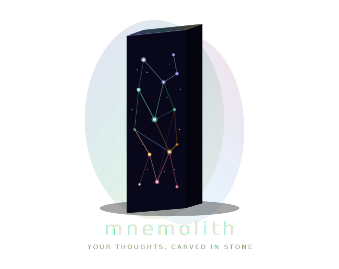

<p align="center">
  
</p>

<p align="center">
  <a href="https://github.com/cbernet/mnemolith/actions/workflows/ci.yml"></a>
  <a href="https://codecov.io/github/cbernet/mnemolith"></a>
  <a href="https://github.com/cbernet/mnemolith/actions/workflows/security-review.yml"></a>
</p> Semantic search over an Obsidian vault using RAG, Qdrant, and MCP.

## Architecture

```text
Obsidian vault (.md) → Indexing script → Embedding API → Qdrant (Docker)
                                                              ↑
Claude ← MCP server (mnemolith-mcp) ─────────────────────────┤
                                                              ↓
                                                   PostgreSQL (Docker)
                                                   (structured data)
                                                         ↑
                                                   CloudBeaver (Docker)
                                                   (web UI, port 8978)
```

## Quick start

```bash
git clone https://github.com/cbernet/mnemolith.git
cd mnemolith
uv sync                          # install dependencies
cp .env.example .env             # configure (set OBSIDIAN_VAULT_PATH, OPENAI_API_KEY)
docker compose up -d             # start Qdrant, PostgreSQL, CloudBeaver
uv run mnemolith index           # index your vault
uv run mnemolith search "query"  # search
uv run mnemolith backup          # backup PostgreSQL + Qdrant
uv run mnemolith restore <path>  # restore from a backup
```

## Documentation

- [Obsidian Setup](docs/obsidian-setup.md) — install Obsidian, set up Git backup
- [Getting Started](docs/getting-started.md) — install mnemolith, index, first search
- [Configuration](docs/configuration.md) — environment variables and options
- [MCP Setup](docs/mcp-setup.md) — let Claude search your vault (Desktop & Code)
- [Claude Code Plugin](docs/claude-plugin.md) — plugin install, vault search, PostgreSQL, note creation
- [CLI Reference](docs/cli-reference.md) — all commands and flags
- [How It Works](docs/how-it-works.md) — architecture, parsing, chunking, embedding

## When to use PostgreSQL vs Obsidian

Mnemolith has two backends — use the right one for the job:

| Data type | Where | Example |
| --- | --- | --- |
| Structured: fields, states, numbers | PostgreSQL table | Portfolio holdings, habit tracker, todo list |
| Unstructured: prose, research, thinking | Obsidian note | Company research, meeting notes, journal |

**You don't need foreign keys between them.** Claude bridges both backends at query time. For example, if you track `ASML` in a PG `companies` table and write investment research in `Companies/ASML.md`, asking Claude "what's my thesis on ASML?" will pull from both sources automatically.

Resist the urge to add a `notes` table in PG — that's what your vault is for.

## Prerequisites

- Python 3.13+
- [uv](https://docs.astral.sh/uv/)
- Docker (for Qdrant and PostgreSQL)
- An OpenAI API key

## Development

```bash
uv sync                              # install deps
docker compose up -d                                     # start Qdrant, PostgreSQL, CloudBeaver
uv run pytest -m "not integration and not pg_integration" # unit tests only
uv run pytest                                            # all tests (requires Qdrant + PostgreSQL)
```

## Project structure

```text
src/mnemolith/
    config.py        # Environment variable handling
    main.py          # CLI entry point (index, search, backup, restore)
    backup.py        # Backup and restore (pg_dump + Qdrant snapshots)
    parser.py        # Obsidian-aware markdown parser (frontmatter, wiki-links, tags)
    embeddings.py    # Embedding provider abstraction (OpenAI)
    indexer.py       # Vault indexing pipeline
    qdrant_store.py  # Qdrant vector store client
    pg_store.py      # PostgreSQL structured data store
    mcp_server.py    # MCP server exposing search + SQL tools to Claude
tests/
    fixtures/vault/  # Sample markdown notes for testing
.claude-plugin/
    plugin.json      # Claude Code plugin manifest
skills/
    obsidian-notes/
        SKILL.md     # Note creation skill for Claude Code
docs/                # User documentation
```

## License

MIT
